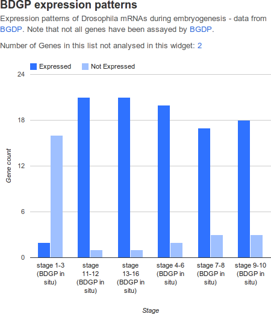

.. index:: embedding, javascript embedding, widgets, list widgets, list analysis page widgets

List Widgets
============

.. toctree::
    :maxdepth: 2
      
    q-and-a
    enrichment-widgets

.. seealso:: `FlyMine list widgets example on Tinkerbin <http://tinkerbin.com/Xb3SZhOK>`_.

There are several list widgets (widgets from now on) available on the InterMine list analysis page, and they are configured in :doc:`/webapp/properties/webconfig-model`.

There are three categories of widgets:

table
    displays the counts from the list for the collection specified
graph
    displays a chart based on a dataset you specify
enrichment
    displays the p-values of objects that appear in your list

To add a widget to your mine:

#. add config to your ``webconfig-model.xml`` file
#. re-release your webapp
#. view widget in a list analysis page

Below are the details on how to configure each widget type.

.. note::

    Please read the documentation carefully and check your config file for typos. Most attributes are case sensitive. When the webapp is released, the config is validated and any errors displayed in the home page.

Configuration
-------------

Table widgets
~~~~~~~~~~~~~

Table widgets display objects and the counts of related objects in your list.

.. figure::  img/table.png
   :align:   center

An example table widget of Orthologues in FlyMine.

===============  =========================================================================  =========================================================
attribute        purpose                                                                    example
===============  =========================================================================  =========================================================
``id``           unique id used by javascript only. Spaces not allowed.                     ``unique_id``
``pathStrings``  which collection to use in the widget                                      ``Gene.homologues[type=orthologue].homologue.organism``
``exportField``  which field from the objects in your list to export                        ``primaryIdentifier``
``typeClass``    types of lists that should display this widget. Use the simple class name  ``Gene``
===============  =========================================================================  =========================================================

The following are optional attributes:

=====================  ==============================================================================================================================  ============================
attribute              purpose                                                                                                                         example
=====================  ==============================================================================================================================  ============================
``title``              appears at the top of the widget                                                                                                ``Orthologues``
``description``        description of the widget                                                                                                       ``Counts of orthologues``
``displayFields``      which fields from the objects in the collection (in the above example, ``Gene.proteins``) to display, eg. ``primaryAccession``  ``name``
``columnTitle``        heading for the "count" column                                                                                                  ``Orthologues``
``externalLink``       link displayed next to first column, identifier will be appended to link
``externalLinkLabel``  label for external link
``views``              path fields display in the query running when the user clicks on the widget                                                     ``symbol``
=====================  ==============================================================================================================================  ============================

Graph/Chart widgets
~~~~~~~~~~~~~~~~~~~

Graph widgets display datasets in graphical format.

   An example chart widget of BDGP Expression Patterns in FlyMine.

===============  ===================================================================================================================  =============================================
attribute        purpose                                                                                                              example
===============  ===================================================================================================================  =============================================
id               unique id used by javascript only. Spaces not allowed.                                                                ``unique_id``
graphType        which type of chart to render                                                                                         ``ColumnChart``,``BarChart`` or ``PieChart``
startClass       it's the root class for all the paths specified in the configuration [1]_.                                            ``Gene``
typeClass        type of lists that should display this widget. Use the simple class name.                                             ``Gene``
categoryPath     Must be attribute. We can specify the subclass using the syntax ``path[subclass type]``                               ``mRNAExpressionResults.stageRange``
seriesPath       the series path. This has to be an attribute. We can specify the subclass using the syntax ``path[subclass type]``    ``mRNAExpressionResults.expressed``
seriesValues     the values of different series. Case sensitive. You can specify boolean values                                        ``true,false`` or ``Up,Down``
seriesLabels     the labels displayed on the graphs to distinguish inside a category the different series                              ``Expressed,Not Expressed`` or ``Up,Down``
views            attributes paths displayed when the user clicks an area on the graph                                                  ``name,organism.name``
===============  ===================================================================================================================  =============================================

.. [1] All the paths set, will be built starting from that. Specify only the simple name (e.g. ``Gene``). You can choose to set the bag type class or the root class associated to the category path.

.. warning::

    You can specify **only one** class in ``typeClass``. If you need another type, you have to define a new widget.

The following are optional attributes:

===================  ====================================================================================================================  =====================================
attribute            purpose                                                                                                               example
===================  ====================================================================================================================  =====================================
``title``            appears at the top of the widget                                                                                      ``BDGP expression patterns``
``description``      description of the widget                                                                                             ``Expression patterns``
``domainLabel``      Label displayed on x-axis in the ColumnChart (on y-axis in the BarChart)                                              ``Stage``
``rangeLabel``       Label displayed on y-axis in the ColumnChart (on x-axis in the a BarChart)                                            ``Gene count``
``filterLabel``      label for filter form field                                                                                           ``Organism``
``filters``          the values for the filter, set in the dropdown [2]_.                                                                  ``All,KEGG pathways,Reactome data``
``listPath``         the path used to build the bag constraint [3]_.                                                                       ``FlyAtlasResult.material``
``constraints``      separated by comma, case sensitive, must be attributes, operator can be `=` or `!=` [4]_                              ``organism.name=[Organism]`` [5]_
===================  ====================================================================================================================  =====================================

.. [2] We can use static values or a grammar to specify the values contained in the list. The default value in general is the first value set in the 'filters' attribute or the first value returned by the query. With static values, you can add 'All' meaning no filter applied.
.. [3] Optional if the ``startClass`` contains the bag type class.
.. [4] For the values we can use static values or the selected filter value using the syntax: ``path constraint = [filter identifier]``.
.. [5] organism's name matching with the value selected in the filter with filterLabel 'Organism'

.. note::

    The graphs use `Google Visualitation API <https://developers.google.com/chart/interactive/docs/reference>`_.

Enrichment widgets
~~~~~~~~~~~~~~~~~~

Enrichment widgets calculate p-values representing the probability annotation occurred by chance. See :doc:`enrichment-widgets` for more information on how the p-value is calculated.

.. figure::  img/enrichment.png
   :align:   center

   An example enrichment widget of Gene Ontology in FlyMine.

=====================  ====================================================================================================  =============================================
attribute              purpose                                                                                               example
=====================  ====================================================================================================  =============================================
``id``                 unique id used by JavaScript only. Spaces not allowed.                                                ``unique_id``
``startClass``         Root class for all the paths specified in the configuration. Use simple name (e.g. Gene)              ``Gene``
``startClassDisplay``  Field displayed when user clicks on the widget on 'Matches' column                                    ``primaryIdentifier``
``typeClass``          Type of lists that should display this widget. Use the simple class name.                             ``Gene``
``enrich``             Field to be enriched, displayed in the widget in the firts column [6]_.                               ``goAnnotation.ontologyTerm.parents.name``
``views``              attributes paths displayed when the user clicks on *View results* button [6]_.                        ``symbol,organism.name``
=====================  ====================================================================================================  =============================================

.. [6] You have to specify only one field. Specify the subclass using the syntax ``path[subclass type]``.

.. warning::

    You can specify **only one** class in ``typeClass``. If you need another type, you have to define a new widget.

The following are optional attributes:

======================  =============================================================================================================================  ============================
attribute               purpose                                                                                                                        example
======================  =============================================================================================================================  ============================
``title``               appears at the top of the widget                                                                                               ``Gene Ontology Enrichment``
``description``         description of the widget                                                                                                      ``GO terms enriched.``
``label``               heading for the column                                                                                                         ``GO Term``
``externalLink``        link displayed next to first column                                                                                            ``googie``
``filters``             extra filters to add to the display [7]_                                                                                       ``organism.name=[list]`` 
``filterLabel``         label for filter form field                                                                                                    ``Ontology``
``enrichIdentifier``    identifier for the row displayed, if not specified, enrich field used [8]_.                                                    ``goAnnotation.ontologyTerm.
                                                                                                                                                       identifier``
``constraints``         constraints separated by comma. The paths have to be attributes. The operator can be ``=`` or ``!=`` [9]_.                     ``organism.name=[list]`` 
``constraintsForView``  constraints separated by comma used for building the query executed when the user clicks on the widget on 'Matches' column     ``results.expressed = true``
``correctionCoeff``
======================  =============================================================================================================================  ============================

.. [7] Use static values or a grammar to specify the values contained in the list. The default value in general is the first value set in the 'filters' attribute or the first value returned by the query. With static values, you can add 'All' meaning no filter applied.
.. [8] Specify only one. This has to be an attribute. Used in the results table. Specify the subclass using the syntax ``path[subclass type]``.
.. [9] Case sensitive. For the values we can use: static values the selected filter value using the syntax: ``path contraint = [filter identifier]`` only the value contained in the list.

Examples
~~~~~~~~

See other mines' config files for more examples, eg:

* ``branches/intermod_workshop/flymine/webapp/resources/webapp/WEB-INF/webconfig-model.xml`` in FlyMine
* ``branches/intermod_workshop/modmine/webapp/resources/webapp/WEB-INF/webconfig-model.xml`` in modMine
* ``branches/intermod_workshop/metabolicmine/webapp/resources/webapp/WEB-INF/webconfig-model.xml`` in metabolicMine

Displaying widgets
------------------

JavaScript
~~~~~~~~~~

Widget service
^^^^^^^^^^^^^^

Create a new Widgets instance pointing to a service:

.. code-block:: javascript

    var widgets = new intermine.widgets("http://beta.flymine.org/query/service/");

Choose a widget
^^^^^^^^^^^^^^^

Choose which widget(s) you want to load:

.. code-block:: javascript

    // Load all Widgets:
    widgets.all('Gene', 'myList', '#all-widgets');
    // Load a specific Chart Widget:
    widgets.chart('flyfish', 'myList', '#widget-1');
    // Load a specific Enrichment Widget:
    widgets.enrichment('pathway_enrichment', 'myList', '#widget-2');
    // Load a specific Table Widget:
    widgets.table('interactions', 'myList', '#widget-3');

CSS
~~~

.. note::

    Widgets are using `Twitter Bootstrap <http://twitter.github.com/bootstrap>`_ CSS framework.

Embedding mine widgets on a custom page
~~~~~~~~~~~~~~~~~~~~~~~~~~~~~~~~~~~~~~~

Following is a documentation describing how to embed widgets not in a mine context.

.. note::
    
    Online example can be visited at `tinkerbin <http://tinkerbin.com/Xb3SZhOK>`_.

#. Open up a document in your text editor.
#. Use the :doc:`/embedding/api-loader` that always gives you the latest version of the widgets. In the ``<head>`` element of the page, add the following line:

    .. code-block:: html
        
        

#. Load the Widget Service:

    .. code-block:: html

        

    ``intermine.load`` represents a block of code that loads the widgets by pointing them to a specific mine.
#. Use the widget web service to view which widgets are available on the mine, eg: `http://beta.flymine.org/beta/service/widgets/`
#. See which lists are available in the mine: `http://beta.flymine.org/query/service/lists`
#. Add a widget (from the list in the previous step) to JavaScript. So within the ``intermine.load`` block, after creating the ``Widgets`` instance, do this:

    .. code-block:: javascript

        // Load all Widgets:
        Widgets.all('Gene', 'myList', '#all-widgets');
        // Load a specific Chart Widget:
        Widgets.chart('flyfish', 'myList', '#widget-1');
        // Load a specific Enrichment Widget:
        Widgets.enrichment('pathway_enrichment', 'myList', '#widget-2');
        // Load a specific Table Widget:
        Widgets.table('interactions', 'myList', '#widget-3');

    Where the *first parameter*' passed is either type of object or name of widget to load. The *second* is the name of list (public list) to access and *third* is an element on the page where your widgets will appear. This element needs to obviously exist on the page first. A common one is a div that would look like this: ``

``.

#. Add HTML, eg:

    .. code-block:: html

        <html xmlns="http://www.w3.org/1999/xhtml">
        <head>
            <meta http-equiv="Content-Type" content="text/html; charset=utf-8" />
            <title>test</title>
            
            
        </head>

        <body>
            <!-- DIV goes here -->
            

        </body>
        </html>

#. You will have noticed that the widgets either pickup a style (CSS) from your HTML page, or they appear unstyled. To style them, you can use a variant of Twitter Bootstrap.
