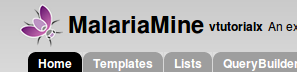
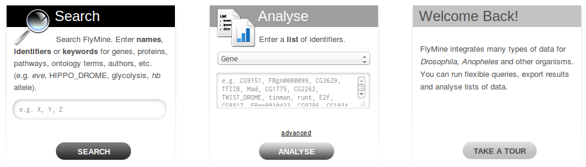

# Tutorial - Configure your InterMine webapp!

This tutorial aims to cover the basics of configuring an InterMine webapp.

## Overview

In general, customisation of InterMine is accomplished by updating the appropriate configuration file and redeploying the webapp. A few features are updated via tagging as well. See [Guide to Customising your Web Application](../../webapp/index.md) for the full documentation on the webapp.


You should have completed the previous tutorial and have successfully deployed the webapp.


This tutorial is intended to give a general idea of what you can customise in InterMine and how to do it. We\'re going to go through each section of the webapp and give step by step instructions on how to configure different parts of the page. This is a detailed tutorial and should take you a few hours to complete -- however it is not meant to be comprehensive. Where topics aren't covered, there are links provided for more information. If you have a question that you don't see answered, try searching the documentation or taking a look at the index. Intermine has an active developer's [Mailing list](../../support/mailing-list.md) as well.



You will need to have Tomcat running for this tutorial.

If your webapp is under heavy usage or development, Tomcat may run out of memory. See [Tomcat](../../system-requirements/software/tomcat.md) for details on how to update your settings to adjust the amount of memory available to Tomcat.



## General Layout

Each web page in InterMine has the same header and footer. The header contains everything at the top of the page, including the navigation tabs and the keyword search. The footer contains the contact form and InterMine logo.


Let's start configuring our mine by updating these common sections of our web application.

### Header

#### Logo

First, let's update the logo of your site. The logo should be 45x43pixels and named `logo.png`, for example:


1. Copy your image into this directory:

   `./webapp/src/main/webapp/model/images/logo.png`.

2. Deploy your webapp with this command:

```text
$ ./gradlew cargoRedeployRemote
```

1. Refresh your browser



You should see your new logo at the top left corner of your webapp. If you don't, try clearing your browser's cache.

#### clean

If your changes are still not being reflected in your webapp, add the `clean` target:

```text
$ ./gradlew clean; ./gradlew cargoRedeployRemote
```

This removes all temporary directories so you are certain your new files are being used.

See [Gradle - Quick Start](../../system-requirements/software/gradle/index.md) for a list of all available Gradle tasks.

#### Subtitle and Release version

Next to the name of your mine in the header is the release version and subtitle for your mine:


These values are set in [Database and Web application](../../webapp/properties/intermine-properties.md) file. This is the same properties file you updated in the previous tutorial. The subtitle and release versions are populated by the properties `project.subTitle` and `project.releaseVersion`, respectively. Update these properties to a different value and redeploy your webapp using the commands given below. Once you have successfully released your webapp, you should see your new subtitle.

1. Open the properties file in your favourite text editor.

   ```text
   $ emacs ~/.intermine/biotestmine.properties
   ```

2. Update the values of the subtitle and release version. Save your

   work.

   ```text
   # text that appears in the header and elsewhere
   project.title=BioTestMine
   project.subTitle=An example of InterMine.bio with data from <i>Plasmodium falciparum</i>
   project.releaseVersion=tutorialx
   ```

3. Redeploy your webapp

   ```text
   $ ./gradlew cargoRedeployRemote
   ```

4. Navigate to your mine's home page and see the updated values:

   [http://localhost:8080/biotestmine](http://localhost:8080/biotestmine)


That's it! Well done! The majority of mine configuration will be accomplished this way - update a property in a text file and redeploy the webapp.

See [Database and Web application](../../webapp/properties/intermine-properties.md) for the full list of properties this file controls.

#### How do I know which property to change?

Now you know how to change properties and configure your mine. How then do you know _which_ property to change? There are a few resources available to you:

[**Guide to Customising your Web Application**](../../webapp/index.md)\*\*\*\*

A detailed listing of everything you can configure in the InterMine webapp. It's grouped by InterMine webpage, e.g. Home Page, so you should be able to find what you need easily.

**Google**

The search for this site is quite good although you can still use Google, e.g. here's [a Google search for help with logos](http://google.com/?q=logo+site%3Aintermine.readthedocs.org).

**Table of Contents / Index**

On the upper right hand corner of every page are links to the Index and the table of contents. Both are fairly comprehensive.

**Ask us!**

A quick email to the dev [Mailing list](../../support/mailing-list.md) usually proves to be quite helpful too.



You can also see and edit the values of every property set for your mine.

1. Log in as the superuser for your mine. \(See [Website Admin](../../webapp/admin/index.md) for details on how to do this.\)
2. Change the last part of the URL in your browser to be `showProperties.do`, e.g. [http://localhost:8080/biotestmine/showProperties.do](http://localhost:8080/biotestmine/showProperties.do)

This lists all properties that are used in your webapp. You can update the values for each property and instantly see how the webapp is changed, without worrying about breaking anything. \(The changes only last for that session, to permanently change a value you'll need to update the appropriate config file.\)



### Keyword Search

InterMine's keyword search uses a Lucene-based index created at build-time. Every field in the database is indexed unless you configure a table or column to be skipped. You can also configure facets / categories to help your users mine the search results. See [Keyword Search](../../webapp/keyword-search/index.md) for details on how to configure the keyword search.



When the first search is executed after a webapp is released, the search index is:

1. Retrieved from the database
2. Written to temp files
3. Loaded into memory for use by the webapp

This can take up to a minute. Our release scripts include a command to run this search so that the index is preloaded.



The search box contains example identifiers to help your users know which types of search terms to use. To update the default value, set the `quicksearch.example.identifiers` property in the [web.properties](../../webapp/properties/web-properties.md) file. Redeploy your webapp to see your changes.


The Lucene index can become quite large, depending on the size of the database. FlyMine's index is ~2G, so make certain you have plenty of room.


### Footer

The footer is positioned at the bottom of every page in the InterMine webapp. It contains the contact link and the funding message.


To update the funding message, change the `funding` property in [Text and messages](../../webapp/properties/model-properties.md). Redeploy your webapp to see your changes.

```text
# Model specific internationalisation properties
# this file merges with InterMineWebApp.properties

funding = InterMine is funded by the <a href="http://www.wellcome.ac.uk/" target="_new" title="Wellcome Trust"></a> and interoperation is funded by <a href="http://www.nih.gov/" target="_new" title="US National Institutes of Health"></a>
```

Here is the bit of code in footer.jsp that renders that message: [https://github.com/intermine/intermine/blob/dev/intermine/webapp/main/resources/webapp/footer.jsp\#L31](https://github.com/intermine/intermine/blob/dev/intermine/webapp/main/resources/webapp/footer.jsp#L31)

The [model.properties](../../webapp/properties/model-properties.md) is the third configuration file you've edited today, there are four main files that control most of the behaviour in your InterMine webapp.



[**~/.intermine/biotestmine.properties**](../../webapp/properties/intermine-properties.md)\*\*\*\*

database and webapp names and locations, includes passwords and shouldn't be in source control.

[**web.properties** ](../../webapp/properties/web-properties.md)\*\*\*\*

webapp behaviour, e.g. link outs, tabs on home page

[**model.properties**](../../webapp/properties/model-properties.md)\*\*\*\*

text displayed on webapp, e.g. error messages

[**webconfig-model.xml**](../../webapp/properties/webconfig-model.md)\*\*\*\*

webapp functionality, e.g. custom export types, widgets, data display



See [General Layout](../../webapp/layout/index.md) for more details on how to update the header, footer and colour scheme of your InterMine webapp. Next we'll customise your home page.

## Home page

Almost everything on the home page is customisable. You can edit the text and set which RSS news feed to use. If you want something very different, you can create and use your own home page.

### Boxes

You can customise the text in the three boxes that appear on the top of the home page. Let\'s edit the example given in the middle box marked `Analyse`.



Notice the text box already has an example, `e.g. X, Y, Z`. This is the default example and it's set by `begin.listBox.example` in an InterMine properties file, `global.web.properties`.

Add `begin.listBox.example` to your mine's [Features](../../webapp/properties/web-properties.md) file and redeploy your webapp to see your changes.

See [Home page](../../webapp/homepage/index.md) for more details on how to update your home page.

