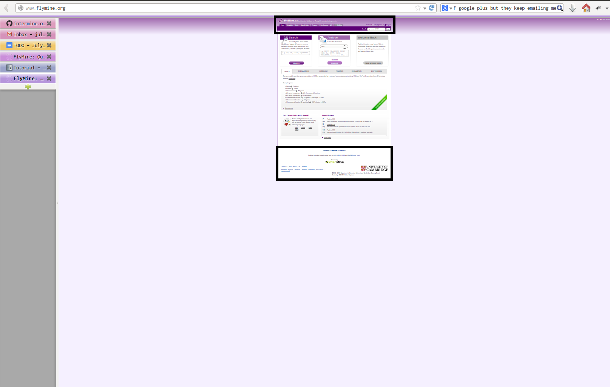
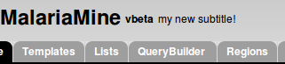
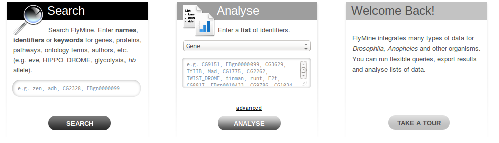

Tutorial - Configure your InterMine webapp
================================================

This tutorial aims to cover the basics of configuring an InterMine webapp.

Overview
----------------------

In general, customisation of InterMine is accomplished by updating the appropriate configuration file and redeploying the webapp. A few features are updated via tagging as well. See :doc:`/webapp/index` for the full documentation on the webapp.  

.. note::

	You should have completed the previous tutorial and have successfully deployed the webapp.

This tutorial is intended to give a general idea of what you can customise in InterMine and how to do it. We're going to go through each section of the webapp and give step by step instructions on how to configure different parts of the page. This is a detailed tutorial and should take you a few hours to complete -- however it is not meant to be comprehensive. Where topics aren't covered, there are links provided for more information. If you have a question that you don't see answered, try searching the documentation or taking a look at the index. Intermine has an active developer's :doc:`/support/mailing-list` as well.

Tomcat
---------

You will need to have Tomcat running for this tutorial.

If your webapp is under heavy usage or development, Tomcat may run out of memory. See :doc:`/system-requirements/software/tomcat` for details on how to update your settings to adjust the amount of memory available to Tomcat. 

If Tomcat has run out of memory, it may not shut down correctly. Memory handling seems to have greatly improved with Tomcat 7 however.

General Layout
---------------------

Each web page in InterMine has the same header and footer. The header contains everything at the top of the page, including the navigation tabs and the keyword search. The footer contains the contact form and InterMine logo.

   Header and footer of FlyMine website

Let's start configuring our mine by updating these common sections of our web application.

Header
~~~~~~~

Logo
^^^^^

First, let's update the logo of your site. The logo should be 45x43 and named `logo.png`, for example:

.. figure:: ../../imgs/logo.png
   :align:   center

   FlyMine's logo

1. Copy your image into this directory: `MINE_NAME/webapp/resources/webapp/model/images`. (If you don't have a logo for your mine yet, you can still test updating your mine by using the FlyMine logo above.)
2. Deploy your webapp with this command:

.. code-block:: bash

	$ ant default remove-webapp release-webapp

3. Refresh your browser

.. figure:: ../../imgs/new-logo.png
   :align:   center

   Updated logo

You should see your new logo in the top left corner of your webapp. If you don't, try clearing your browser's cache.

ant targets
^^^^^^^^^^^^^^^^^^^^^^

If your changes are still not being reflected in your webapp, add the `clean` target:

.. code-block:: bash

	$ ant clean; ant default remove-webapp release-webapp

This removes all temporary directories so you are certain your new files are being used. The `clean-all` target removes
temporary directories from all dependencies as well.

See :doc:`/system-requirements/software/ant/` for a list of all ant targets.

Subtitle and Release version
^^^^^^^^^^^^^^^^^^^^^^^^^^^^^^^^^^^^^^^^^^^^

Next to the name of your mine in the header is the release version and subtitle for your mine:

   Title, release version and subtitle

These values are set in :doc:`/webapp/properties/intermine-properties` file. This is the same properties file you updated in the previous tutorial. The subtitle and release versions are populated by the properties `project.subTitle` and `project.releaseVersion`, respectively. Update these properties to a different value and redeploy your webapp using the commands given above. Once you have successfully released your webapp, you should see your new subtitle.

1. Open the properties file in your favourite text editor.

.. code-block:: bash 

	$ emacs ~/.intermine/malariamine.properties

2. Update the values of the subtitle and release version. Save your work.

.. code-block:: properties

	# text that appears in the header and elsewhere
	project.title=MalariaMine
	project.subTitle=An example of InterMine.bio with data from <i>Plasmodium falciparum</i>
	project.releaseVersion=tutorialx

3. Redeploy your webapp

.. code-block:: bash

	$ ant default remove-webapp release-webapp

4. Navigate to your mine's home page and see the updated values: http://localhost:8080/malaria

   Updated release version and subtitle

That's it! Well done! The majority of mine configuration will be accomplished this way - update a property in a text file and redeploy the webapp.

See :doc:`/webapp/properties/intermine-properties` for the full list of properties this file controls.

How do I know which property to change?
^^^^^^^^^^^^^^^^^^^^^^^^^^^^^^^^^^^^^^^^^^^^

Now you know how to change properties and configure your mine. How then do you know *which* property to change? There are a few resources available to you:

:doc:`/webapp/index` 
	A detailed listing of everything you can configure in the InterMine webapp. It's grouped by InterMine webpage, e.g. Home Page, so you should be able to find what you need easily.
Google
	The search for this site is quite good although you can still use Google, e.g. here's `a Google search for help with logos <http://google.com/?q=logo+site%3Aintermine.readthedocs.org>`_. 
Table of Contents / Index
	On the upper right hand corner of every page are links to the Index and the table of contents. Both are fairly comprehensive.
Ask us!
	A quick email to the dev :doc:`/support/mailing-list` usually proves to be quite helpful too.

Show all properties
^^^^^^^^^^^^^^^^^^^^^^

You can also see and edit the values of every property set for your mine.

1. Log in as the superuser for your mine. (See :doc:`/webapp/admin/index` for details on how to do this.)
2. Change the last part of the URL in your browser to be `showProperties.do`, e.g. http://localhost:8080/malaria/showProperties.do

This lists of all properties in all configuration files that are used in your webapp. 

Keyword Search 
~~~~~~~~~~~~~~~~~~~~~

InterMine's keyword search is a powerful Lucene-based search created at build-time. Every field in the database is indexed unless you configure a table or column to be skipped. See :doc:`/webapp/keyword-search/index` for details on how to configure the keyword search index and results. You can also configure facets / categories to help your users mine the data.

When the first search is executed after a webapp is released, the index is retrieved from the database, written to temp files and loaded into memory. This can take up to a minute. (Our release scripts include a command to run this search so that the index is ready.)

The search box contains example identifiers to help your users know which types of search terms to use. To update the default value, set the `quicksearch.example.identifiers` property in the :doc:`web.properties </webapp/properties/web-properties>` file. Redeploy your webapp to see your changes.

.. warning::

	The Lucene index can be quite large, depending on the size of the database. FlyMine's index is ~2G, so make certain you have plenty of room.

Footer
~~~~~~~~~~~~~~

The footer is positioned at the bottom of every page in the InterMine webapp. It contains the contact link and the funding message.

To update the funding message, change the `funding` property in :doc:`/webapp/properties/web-properties`. Redeploy your webapp to see your changes.

properties files
^^^^^^^^^^^^^^^^^^^^^^

These four files control the majority of the behaviour of your InterMine webapp:

:doc:`~/.intermine/malariamine.properties </webapp/properties/intermine-properties>`
  database and webapp names and locations. includes passwords and shouldn't be in source control.

:doc:`web.properties </webapp/properties/web-properties>`
  webapp behaviour, e.g. link outs, tabs on home page

:doc:`model.properties </webapp/properties/model-properties>`
  text displayed on webapp, e.g. error messages

:doc:`webconfig-model.xml </webapp/properties/webconfig-model>`
  webapp functionality, e.g. custom export types, widgets, data display

See :doc:`/webapp/layout/index` for more details on how to update the header, footer and colour scheme of your InterMine webapp. Next we'll customise your home page.

Home page
----------------------

Most everything on the home page is customisable. You can edit the text and set which RSS news feed to use. If you want something very different, you can create and use your own home page.

Boxes
~~~~~~~

You can customise the text in the three boxes that appear on the top of the home page. Let's edit the example given in the middle box marked `Analyse`.

   Three boxes at the top of the home page

Notice the text box already has an example, `e.g. X, Y, Z`. This is the default example and it's set by `begin.listBox.example` in an InterMine properties file, `global.web.properties`.

Add `begin.listBox.example` to your mine's :doc:`/webapp/properties/web-properties` file and redeploy your webapp to see your changes.

InterMine, bio and mine /webapp
^^^^^^^^^^^^^^^^^^^^^^^^^^^^^^^^^^^^^^^^^^

In Intermine there are 3 webapp projects: InterMine, bio and mine. You shouldn't ever have to change the files in InterMine and bio, you'll only ever update your mine's files. When the webapp is compiled, the build system starts with the InterMine webapp project, then merges bio into that. Finally your mine's webapp is added. The files and properties set in bio override any in the InterMine project. Your mine's files and properties override any in bio or InterMine.

Therefore when you set `begin.listBox.example` in your properties file, it overrode the same property set in the InterMine properties file. This will be true of any property.

Use your own
~~~~~~~~~~~~~~~~~~~

The text and settings are configurable, but you may want a different layout for your home page. 

1. Copy `begin.jsp` from `intermine/webapp` into your own webapp directory: `MINE_NAME/webapp/resources/webapp/model`.
2. Edit your begin.jsp 
3. Redeploy your webapp to show your change

We saw in the previous section that properties override InterMine properties. The same holds true for JSP pages.

Note: Changes made to the home page, or whichever page you updated, will not be reflected in your custom copy.

See :doc:`/webapp/homepage/index` for more details on how to update

