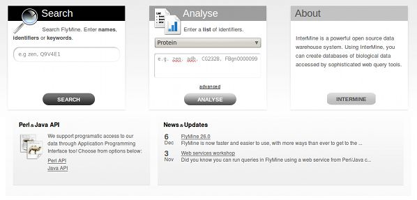

Home page
=========

.. note::
    
    This text describes how to customize the homepage of your mine.

If you have just installed a new mine, your homepage probably looks something like the following:

In order to do any sort of customizations, one has to add/edit a configuration file for the mine. You will find this file in ``<your_mine_name>/webapp/resources/web.properties``.

Open this file in your editor of choice and follow the text below.

Boxes Customization
-------------------

The three prominent boxes on the homepage will contain a search functionality a list upload functionality and an info box. You can customize the text these contain and how they are called. For example, we might want to change the title of the list upload box to say "List Upload" instead of the default "Analyse". We might also want to change the informative text the box contains and provide a set of example identifiers that one can analyse. Then, we would add the following text to the config file:

.. code-block:: properties

    begin.listBox.title = List Upload
    begin.listBox.description = Enter a <strong>list</strong> of identifiers.
    begin.listBox.example = e.g. zen, adh, CG2328, FBgn0000099

.. note::
    
    You will find that only the description field accepts HTML.

The first search box is configured in much the same way as the list upload one is:

.. code-block:: properties

    begin.searchBox.title = Search
    begin.searchBox.description = Search FlyMine. Enter <strong>names</strong>, <strong>identifiers</strong> \
    or <strong>keywords</strong> for genes, proteins, pathways, ontology terms, authors, etc. (e.g. \
    <em>eve</em>, HIPPO_DROME, glycolysis, <em>hb</em> allele).

Basically, we have only changed listBox to say searchBox in the configuration.

The third/info box can contain a descriptive text about your mine or it can offer a link to a tour of the project. Take the example from FlyMine project:

.. code-block:: properties

    begin.thirdBox.title = First Time Here?
    begin.thirdBox.description = FlyMine integrates many types of data for <em>Drosophila</em>, \
    <em>Anopheles</em> and other organisms. You can run flexible queries, export results and analyse lists of \
    data.
    begin.thirdBox.link = http://www.flymine.org/help/tour/start.html
    begin.thirdBox.linkTitle = Take a tour

By providing the .link parameter a button will be shown at the bottom of the box with a custom link of choice.

Since InterMine 0.96, you can serve up a custom text in the third "information" box to the user, based on whether they have visited the homepage before or not. We do this through a cookie that will, for a year, indicate for your computer, that the homepage has been visited.

In order to change the values of the third box based on whether the user has visited the page or not, prepend the text "visited" before an uppercased key. For example, if one wanted to say "Welcome Back" instead of "First Time Here?" as the title of the box, we would add the following key=value pair:

.. code-block:: properties

    begin.thirdBox.visitedTitle = Welcome Back

The fields that you do NOT set in this way, will simply show the text configured in the normal way. So even though someone has visited the homepage before, unless I add a "visited" property, the text stays the same as before.

Popular Templates Customization
-------------------------------

By visiting the Templates page one can see a listing of templates in different categories. If you would like to show 10 most popular templates per category on your homepage, follow this text.

.. image:: img/popular_templates.jpg

Configuring the popular templates is very straightforward. Let us say that we have a Genomics category of templates. To add it to the homepage, we will add the following to the config file:

.. code-block:: properties

    begin.tabs.1.id = Genomics

What this configuration does is it creates a tab on the homepage with (up to) 10 most popular templates from a Genomics category. The number in the config key specifies the order in which we want to show them. So if we have two categories, Genomics and Proteins, and they should appear in this order, we would write this:

.. code-block:: properties

    begin.tabs.1.id = Genomics
    begin.tabs.2.id = Proteins

The other customization we can do is specify an informative text that is to appear in the tab above the templates listing (again, this text accepts HTML.):

.. code-block:: properties

    begin.tabs.1.id = Genomics
    begin.tabs.1.description = This is some descriptive text

The last thing we will show is how to specify a custom category name to show as a link on the tab (entirely optional):

.. code-block:: properties

    begin.tabs.1.id = Genomics
    begin.tabs.1.description = This is some descriptive text
    begin.tabs.1.name = Genes

Featured Lists
--------------

Lists with tag ``im:homepage`` will be shown on the homepage below the templates listing in a natural order, and/or an order specified by ``im:order:n``.

To change the description text associated with this set of lists, edit the properties file like so:

.. code-block:: properties

    begin.listsBox.description = These are the best lists ever

RSS/Blog Feed
-------------

To add the RSS feed at the bottom right corner of the page, add the following to your MINE properties file (in ``.intermine`` file):

.. code-block:: properties

    project.rss = http://<your_blog>/<your_feed_url>

eg:

.. code-block:: properties

    project.rss=http://blog.flymine.org/?feed=rss2

Two latest entries will be shown in the box. If you want to provide a link underneath the entry listing to your blog, add the following to the config file:

.. code-block:: properties

    links.blog = http://<your_blog>

Header
------

'''logo'''

Logo is located here: [source:/trunk/flymine/webapp/resources/webapp/model/images webapp/resources/webapp/model/images/logo.png].  

See: [wiki:Themes]

'''tabs''' 

The tabs are set in InterMine's internationalisation file:  [source:/trunk/intermine/webapp/main/resources/webapp/WEB-INF/classes/InterMineWebApp.properties InterMineWebApp.properties].

Each page has a name and a tab, for example:

{{{
mymine.tab = mymine
}}}

In addition to InterMine's file, each mine has its own internationalisation file:  [source:http://intermine.org/browser/trunk/flymine/webapp/resources/model.properties webapp/resources/model.properties].

If you want to add a tab specific to your mine, add an entry to this file.  Properties set in this file overwrite the ones set in [source:/trunk/intermine/webapp/main/resources/webapp/WEB-INF/classes/InterMineWebApp.properties InterMineWebApp.properties].

Data tab

The data tab points to this JSP file - [source:/trunk/intermine/webapp/main/resources/webapp/dataCategories.jsp dataCategories.jsp].  You can overwrite this file and display your own customised file by putting a JSP in your $MINE_NAME/webapp directory.

'''keyword search'''

||''' '''||'''property'''||'''file'''||
||'''example'''||quickSearch.identifiers||WebProperties||

This search box queries the search index created in the postprocess `create-search-index`.  See KeywordSearch for details on how to configure the search index.

Other properties:

||''' '''||'''property'''||'''file'''||
||'''link'''||project.sitePrefix||InterMineProperties||
||'''name of mine'''||project.title||InterMineProperties||
||'''version'''||project.releaseVersion||InterMineProperties|| 
||'''subtitle'''||project.subTitle||InterMineProperties||
||'''links in upper right corner'''||header.links||WebProperties||

Footer 
------------

||''' '''||'''property'''||'''file'''||
||'''recipient email address for contact form'''||feedback.destination||InterMineProperties||
||'''"funded by" text'''||funding||ModelProperties||

Favicon
------------

Favicon (icon seen next to the url of the webapp in the browser url bar) can be set by adding the following line:

`<link rel="shortcut icon" type="image/x-icon" href="model/images/favicon.ico">`

Into the `webapp/resources/webapp/layout.jsp` file in between the opening `<head>` and closing `</head>` tags. Then, the favicon will need to be located in `[mine]/webapp/resources/webapp/model/images/favicon.ico`.

If you want to generate a favicon from an image, use http://tools.dynamicdrive.com/favicon/.

Changing look and feel
--------------------------------

InterMine provides a set of default themes but you can also create your own. All themes are defined in ''intermine/webapp/main/resources/webapp/themes/ ''

Current themes provided with InterMine are listed below. Screenshots of each theme are provided in the ''themes/'' directory.

 * ''blue''
 * ''bright_blue''
 * ''brown''
 * ''ecoli_blue''
 * ''gold''
 * ''green''
 * ''grey''
 * ''metabolic''
 * ''modmine''
 * ''purple''
 * ''ratmine''

To switch themes you have to edit the web.properties file in your mine's webapp directory (''YOUR_MINE/webapp/resources/web.properties'').

{{{
# web.properties
theme = purple
}}}

You need to change this property to the name of the theme you want to use (the directory name), then re-release the webapp.  Be sure to run {{{ant-clean}}} to ensure that all of the old files are deleted.

{{{
# in YOUR_MINE/webapp/resources/webapp
ant clean
ant default remove-webapp release-webapp
}}}

Developing your own theme
--------------------------------

With CSS knowledge and open source image software such as [http://www.gimp.org GIMP] or [http://www.inkscape.org INKSCAPE] it is very easy to develop your own theme. Each theme directory contains a theme.css file, which is broken down in annotated sections, and image files. The image files are required for displaying menus, headers and backgrounds and can be modified with image software to match your colour scheme. Simply create a new directory under ''intermine/webapp/main/resources/webapp/themes/ '', copy the contents of another theme directory into it and start editing.

 * ''corner_act_t_l.png''
 * ''corner_act_t_r.png''
 * ''corner_my_t_l.png''
 * ''corner_my_t_r.png''
 * ''corner_t_l.png''
 * ''corner_t_r.png''
 * ''grad_box.png''
 * ''gray_grad.png''
 * ''heading-bg.gif''
 * ''submenu_indent.png''
 * ''submenu_my.png''
 * ''table-heading-bg.gif''
 * ''theme.css''
 * ''top_gradient.png''
 * ''xml.png''
 
 
Changing the logo
--------------------------------
 
The logo is independent from the themes, and is located in ''YOUR_MINE/webapp/resources/webapp/model/images/logo.png''. To change the logo, simply change this file to your own. The recommended size is w45px by h43px.
