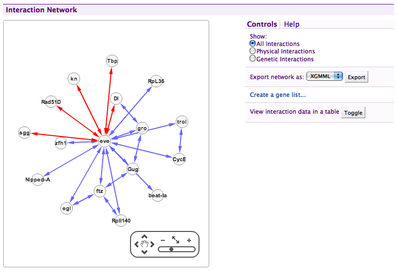
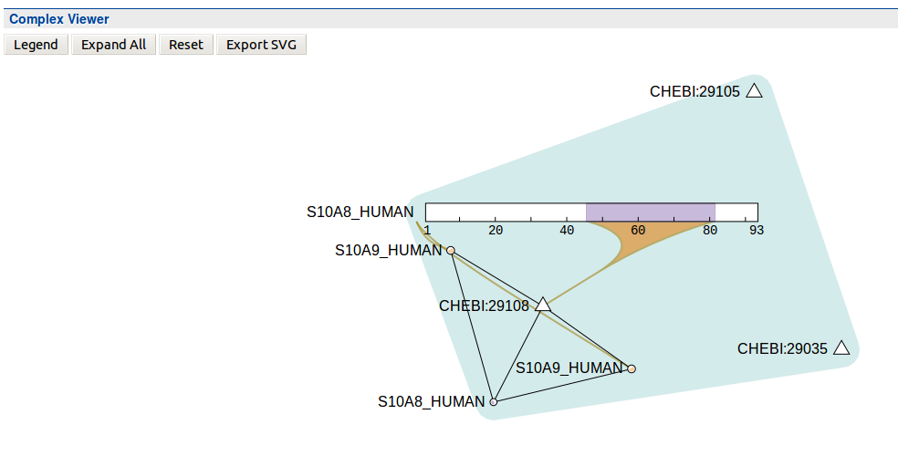

Report displayers you can use in your own Mine and some examples created for specific data types in modMine, FlyMine and metabolicMine.

The following displayers can all be used for data loaded by standard InterMine parsers. To see how to configure them check out FlyMine's `webconfig-model.xml`.

### SequenceFeature summary

Applicable for any SequenceFeature. It shows length, sequence export, chromosome location, cyto location and SO term \(where present\).

```markup
<reportdisplayer javaClass="org.intermine.bio.web.displayer.SequenceFeatureDisplayer"
    jspName="model/sequenceFeatureDisplayer.jsp"
    replacesFields="chromosome,chromosomeLocation,sequence,length,sequenceOntologyTerm,locations,cytoLocation"
    placement="summary"
    types="SequenceFeature"/>
```


### Protein sequence

Applicable for Protein. It shows length, sequence export.

```markup
<reportdisplayer javaClass="org.intermine.bio.web.displayer.ProteinSequenceDisplayer"
    jspName="model/proteinSequenceDisplayer.jsp"
    replacesFields="sequence"
    placement="summary"
    types="Protein"/>
```


### GBrowse

Shows an inline image from a configured GBrowse instance.

```markup
<reportdisplayer javaClass="org.intermine.bio.web.displayer.GBrowseDisplayer"
    jspName="model/gbrowseDisplayer.jsp"
    replacesFields=""
    placement="Genes"
    types="SequenceFeature"/>
```

This also needs two properties to be configured in the `minename.properties` file: `gbrowse.prefix` and `gbrowse_image.prefix` which give the location of a running GBrowse instance.

```text
gbrowse.prefix=http://www.flymine.org/cgi-bin/gbrowse
gbrowse_image.prefix=http://www.flymine.org/cgi-bin/gbrowse_img
```


### Homologues

Shows a table of organism and homologous genes of homologues per organism.

```markup
<reportdisplayer javaClass="org.intermine.bio.web.displayer.HomologueDisplayer"
    jspName="model/homologueDisplayer.jsp"
    replacesFields="homologues"
    placement="Homology"
    parameters="{'dataSets': ['TreeFam data set', 'KEGG orthologues data set']}"
    types="Gene"/>
```


Note that FlyMine includes a specific displayer to show the twelve Drosophila species as a phylogenetic tree.

### Gene structure

Displays transcripts, exons, introns, UTRs and CDSs if present in the model and for the particular organism. It can be added to report pages for any of these feature types and will find the parent gene and show all transcripts, highlighting the feature of the actual report page.

```markup
<reportdisplayer javaClass="org.intermine.bio.web.displayer.GeneStructureDisplayer"
    jspName="model/geneStructureDisplayer.jsp"
    replacesFields="transcripts,exons,CDSs,introns,UTRs,fivePrimeUTR,threePrimeUTR"
    placement="Genomics"
    types="Gene,Transcript,Exon,Intron,UTR,CDS"/>
```


### Gene Ontology

Simple display of GO terms and evidence codes for a gene, grouped by branch in the ontology. It groups by the three main ontologies \(function, process and component\), so you may need to run the GO source.

```markup
<reportdisplayer javaClass="org.intermine.bio.web.displayer.GeneOntologyDisplayer"
    jspName="model/geneOntologyDisplayer.jsp"
    replacesFields="goAnnotation,ontologyAnnotations"
    placement="Function"
    types="Gene"/>
```


### UniProt comments

A clear view of curated comments from UniProt \(SwissProt\) applied to a protein, or for a gene will show comments from all proteins of the gene.

```markup
<reportdisplayer javaClass="org.intermine.bio.web.displayer.UniProtCommentsDisplayer"
    jspName="model/uniProtCommentsDisplayer.jsp"
    replacesFields=""
    placement="summary"
    types="Gene,Protein"/>
```


### Interaction network

Uses the [Cytoscape Web plugin](http://cytoscapeweb.cytoscape.org/) to display physical and genetics interactions. The interaction displayer links to report pages, allows creation of a gene list of the whole network and can show tabular interaction data. Read NetworkDisplayer for details.

```markup
<reportdisplayer javaClass="org.intermine.bio.web.displayer.CytoscapeNetworkDisplayer"
    jspName="model/cytoscapeNetworkDisplayer.jsp"
    replacesFields="interactions"
    placement="Interactions"
    types="Gene,Protein"/>
```



### Overlapping features

A summary view of features that overlap the chromosome location of the reported feature. If the gene structure displayer is also used, it will exclude any features that are part of the same gene model i.e. it won't report that a gene overlaps it's own exons.

```markup
<reportdisplayer javaClass="org.intermine.bio.web.displayer.OverlappingFeaturesDisplayer"
    jspName="model/overlappingFeaturesDisplayer.jsp"
    replacesFields="overlappingFeatures"
    placement="Genomics"
    types="SequenceFeature"/>
```


### Complexes - Protein interactions

Viewer displaying complex interactions. Data must be loaded from IntAct. Original Source: [http://interactionviewer.org/](http://interactionviewer.org/).

```markup
<reportdisplayer javaClass="org.intermine.bio.web.displayer.ComplexDisplayer"
                 jspName="model/complexDisplayer.jsp"
                 replacesFields=""
                 placement="summary"
                 types="Complex"/>
```



### Specific Displayers

There are some displayers created for specific data sets in FlyMine, metabolicMine or modMine that may not be re-usable in other Mines but could be adapted or provide inspiration.


![A phylogenetic tree of Drosophila species displayed using the \[jsPhyloSVG\]\(http://www.jsphylosvg.com/\) JavaScript library in FlyMine.](img/drosophila_homology_displayer.png)

![Heatmap of fly gene expression in modMine, this makes use of \[canvasXpress\]\(http://www.canvasxpress.org/\) JavaScript library.](img/modMine-heatmap.png)
