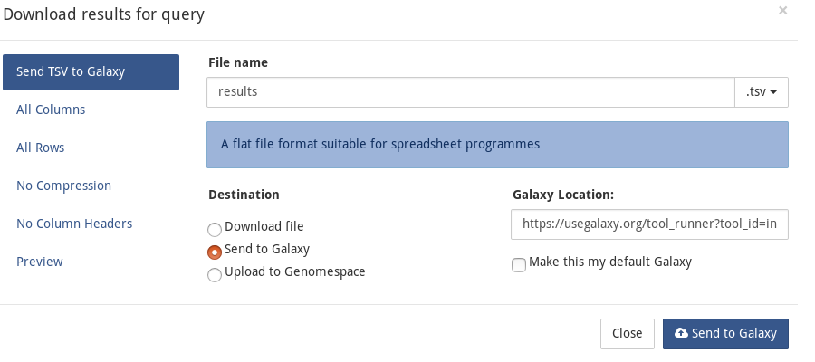
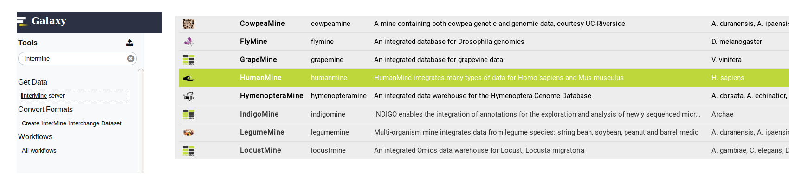

# Galaxy

## Enable Galaxy export

The following properties are set in the \[global.web.properties\]{.title-ref}. You can override any of those in the \[web.properties\]{.title-ref} file.

```text
# in global.web.properties
galaxy.baseurl.default = https://usegalaxy.org
galaxy.url.value = /tool_runner?tool_id=intermine
    galaxy.welcomeMessage = <b>Welcome to InterMine, GALAXY users!</b><br/><br/>You can run queries by clicking on the 'Templates' tab at the top of this page.&nbsp;&nbsp;You can send the query results to Galaxy from the 'EXPORT' menu in the results page.
    galaxy.disabledMessage = Galaxy export is disabled.
```

Update Struts config

```text
# webapp/src/main/resources/struts-config-model.xml
<action path="/galaxyExportOptions" forward="galaxyExportOptions.page"/>
<action path="/initGalaxyExportOptions"
        type="org.intermine.bio.web.struts.GalaxyExportOptionsController"/>
<action path="/galaxyExportAction" name="galaxyExportForm"
        type="org.intermine.bio.web.struts.GalaxyExportAction" parameter="method"/>
```

```text
# webapp/src/main/resources/tiles-defs-model.xml
<definition name="galaxyExportOptions.page" extends="layout.template">
    <put name="body" value="galaxyExportOptions.tile"/>
    <put name="pageName" value="galaxyExportOptions"/>
</definition>
<definition name="galaxyExportOptions.tile" path="/model/galaxyExportOptions.jsp"
        controllerUrl="/initGalaxyExportOptions.do"/>
```

```text
# webapp/src/main/resources/struts-config-model-form.xml
<form-bean name="galaxyExportForm" type="org.intermine.bio.web.struts.GalaxyExportForm"/>
```

## Customization

Properties located in the \'\'global.web.properties\'\'\' file.

parameter purpose required?

display enable Galaxy export yes. disabledMessage displayed when Galaxy export is disabled yes baseurl.default base url of Galaxy server yes. url.value tool runner url yes. welcomeMessage displays on the homepage when coming from Galaxy yes

```text
# galaxy
## set to "false" to disable galaxy
galaxy.display = true
galaxy.disabledMessage = Galaxy export is disabled.
galaxy.baseurl.default = https://usegalaxy.org
galaxy.url.value = /tool_runner?tool_id=intermine
galaxy.welcomeMessage = <b>Welcome to InterMine, GALAXY users</b><br/><br/>You can run queries by \
clicking on the 'Templates' tab at the top of this page.&nbsp;&nbsp;You can send the query results \
to Galaxy from the 'EXPORT' menu in the results page.
```

::: {.index} Galaxy :::

## Export data from InterMine to Galaxy

1. starting from an InterMine instance, e.g. FlyMine, run a query,

   select the option **Export** -&gt; **Send to Galaxy** and the data

   will be exported in the galaxy instance specified in the \*Galaxy

   Location\* field

{.align-center}

1. starting from Galaxy, use the NEW intermine tool to be redirected to

   the InterMine registry, select the InterMine instance you want to

   use to export the data, run the query, select the option **Export**

   -&gt; **Send to Galaxy** and the data will be exported in the Galaxy

   instance you started from.

{.align-center}

Export identifiers from Galaxy to InterMine ------------------------------------Use the new **InterMine interchange dataset** to generate an intermediate file \(tsv formatted\)

{.align-center}

and then click on _View InterMine at Registry_ to be redirected to the InterMine registry in order to chose the InterMine instance to export the identifiers to.

{.align-center}

