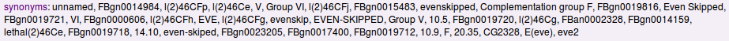

Webapp Tables CSS & HTML
========================

.. image:: img/intermine-theme-colors.png

Inline List
-----------

.. image:: img/inline-list.2.png

.. code-block:: html

    

    <h3>2 probeSets</h3>
    <ul>
        <li>FBgn0014159, </li>
        <li><a>Complementation group F</a>, </li>
    </ul>
    

================================= =================================
CSS                               Description
================================= =================================
``div.inline-list``               wrapping the list and title in div makes it more clear what elements belong together and allow you to set a custom ID on the whole thing
``div.inline-list h3`` (optional) header 3 (see below) styling
``div.inline-list ul``            list we be displayed inline, without margins between items and without list styles (circles, squares etc.)
================================= =================================

Inline List (Inactive, No Results)
~~~~~~~~~~~~~~~~~~~~~~~~~~~~~~~~~~

.. image:: img/inline-list-gray.png

.. code-block:: html

    

        <h3>0 probeSets</h3>
    

================================= =================================
CSS                               Description
================================= =================================
``div.inline-list.gray``          one can apply an 'inactive' theme by attaching a class to the top element
================================= =================================

Inline List (Tagging, Right)
~~~~~~~~~~~~~~~~~~~~~~~~~~~~

.. image:: img/inline-lists-right.png

.. code-block:: html

    

        <h3>
Right positioned
 0 probeSets</h3>
    

======================================== =================================
CSS                                      Description
======================================== =================================
``div.inline-list div.right`` (optional) will float element to the right and apply appropriate colors to links; needs to go first, before any other text
======================================== =================================

'Header' Inline List
~~~~~~~~~~~~~~~~~~~~

.. code-block:: html

    

        <ul>
            <li>synonyms:</li>
            <li>FBgn0014159, </li>
            <li>Complementation group F, </li>
            <li>FBgn0015483, </li>
        </ul>
    

==================================== =================================
CSS                                  Description
==================================== =================================
``div.inline-list .name`` (optional) the main theme color will be applied to the element
==================================== =================================

Collection Table
----------------

.. image:: img/collection-table.png

.. code-block:: html

    

        <h3>1 protein</h3>
        <table>
            <thead>
                <tr><th>primaryIdentifier</th><th>primaryAccession</th></tr>
            </thead>
            <tbody>
                <tr>
                    <td>EVE_DROME</td>
                    <td>P06602</td>
                    </tr>
                    <tr>
                    <td>AUTO_DROME</td>
                    <td>P65</td>
                </tr>
            </tbody>
        </table>
    

========================================== ==========================================
CSS                                        Description
========================================== ==========================================
``div.collection-table h3``                table title will pickup theme colors much like Title (Level 3) below
``div.collection-table thead th,td``       table expects a thead element, that will apply the same background as the title
``div.collection-table.nowrap`` (optional) row columns do not wrap and are displayed inline
========================================== ==========================================

.. note::

    Modern browsers will apply alternating background and border on odd row columns, the rubbish (IE) will be fixed by running jQuery on page load.

Collection Table (Type Column, Text Highlight)
~~~~~~~~~~~~~~~~~~~~~~~~~~~~~~~~~~~~~~~~~~~~~~

.. image:: img/collection-table-class.png

.. code-block:: html

    

        <h3>1 protein</h3>
        <table>
            <thead>
                <tr><th>primaryIdentifier</th><th>primaryAccession</th></tr>
            </thead>
            <tbody>
                <tr>
                    <td class="class">EVE_DROME</td>
                    <td>P06602</td>
                    </tr>
                    <tr>
                    <td class="class">AUTO_DROME</td>
                    <td>P65</td>
                </tr>
            </tbody>
        </table>
    

======================================= =======================================
CSS                                     Description
``div.collection-table table td.class`` applying a 'class' class will highlight the text in the given column
======================================= =======================================

Collection Table (Vertical Column Border)
~~~~~~~~~~~~~~~~~~~~~~~~~~~~~~~~~~~~~~~~~

.. image:: img/column-border.png

.. code-block:: html

    

        <-- ... -->
        <table>
            <-- ... -->
        </table>
    

====================================== ======================================
CSS                                    Description
====================================== ======================================
``div.collection-table.column-border`` uses a pseudoclass to apply a border between columns
====================================== ======================================

.. note::

    Modern browsers will apply alternating background and border on odd row columns, the rubbish (IE) will be fixed by running jQuery on page load.

Collection Table (Vertical Column Border by 2)
~~~~~~~~~~~~~~~~~~~~~~~~~~~~~~~~~~~~~~~~~~~~~~

.. image:: img/column-border-by-2.png

.. code-block:: html

    

        <-- ... -->
        <table>
            <-- ... -->
        </table>
    

=========================================== ===========================================
CSS                                         Description
=========================================== ===========================================
``div.collection-table.column-border-by-2`` uses a pseudoclass to apply a border between every other column
=========================================== ===========================================

.. note::

    Modern browsers will apply alternating background and border on odd row columns, the rubbish (IE) will be fixed by running jQuery on page load.

Collection Table (Inactive, No Results)
~~~~~~~~~~~~~~~~~~~~~~~~~~~~~~~~~~~~~~~

.. image:: img/collection-table-gray.png

.. code-block:: html

    

        <h3>0 genes</h3>
    

============================= =============================
CSS                           Description
============================= =============================
``div.collection-table.gray`` one can apply an 'inactive' theme by attaching a class to the top element
============================= =============================

Collection Table (Tagging, Right)
~~~~~~~~~~~~~~~~~~~~~~~~~~~~~~~~~

.. image:: img/collections-right.png

.. code-block:: html

    

        <h3>
Right positioned
 0 genes</h3>
    

============================================= =============================================
CSS                                           Description
============================================= =============================================
``div.collection-table div.right`` (optional) will float element to the right and apply appropriate colors to links; needs to go first, before any other text
============================================= =============================================

Collection Table (Persistent Table Headers)
~~~~~~~~~~~~~~~~~~~~~~~~~~~~~~~~~~~~~~~~~~~

.. code-block:: html

    

        <-- ... -->
    

=================================== ===================================
CSS                                 Description
=================================== ===================================
``div.collection-table.persistent`` will make table headers persist as you scroll within the table
=================================== ===================================

Basic Table (Generic)
~~~~~~~~~~~~~~~~~~~~~

.. image:: img/tiny-table.png

.. code-block:: html

    

        <h3>Some title</h3>
        <table>
            <tr><td>Row column</td></tr>
        </table>
    

======================================== ========================================
CSS                                      Description
======================================== ========================================
``div.basic-table h3``                   will apply the heading 3 style (see below)
``div.basic-table div.right`` (optional) will float element to the right and apply appropriate colors to links; needs to go first, before any other text
``div.basic-table table``                will make sure that the table is properly collapsed, has padding and does not have cellspacing
``div.basic-table.gray`` (optional)      one can apply an 'inactive' theme by attaching a class to the top element
======================================== ========================================

Collection of Collection Tables
~~~~~~~~~~~~~~~~~~~~~~~~~~~~~~~

.. image:: img/collection-of-collections.png

.. code-block:: html

    

        

            <h3>Regulatory Regions</h3>
            
Description

            

                <a class="active">CRM</a> <a>TFBindingSite</a>
            

        

        

            <-- ... -->
        

        

            <-- ... -->
        

    

================================================================ ================================================================
CSS                                                              Description
================================================================ ================================================================
``div.collection-of-collections``                                a div wrapper for collections
``div.collection-of-collections div.header``                     will apply a background color that of collection table header
``div.collection-of-collections div.header a.active`` (optional) link elements are underlined by default and switched to bold if class 'active' is applied to them
================================================================ ================================================================

Table Togglers (Less, More, Expand, Collapse, Show in table)
~~~~~~~~~~~~~~~~~~~~~~~~~~~~~~~~~~~~~~~~~~~~~~~~~~~~~~~~~~~~

.. image:: img/togglers.png

.. code-block:: html

    

        <-- ... -->
        

            <a class="less">Show less</a>
            <a class="more">Show more</a>
        

        

            <a href="#">Show all in a table</a>
        

    

================================================ ================================================
CSS                                              Description
================================================ ================================================
``div.collection-table div.toggle a.more``       will create apply an expand/more button
``div.collection-table div.toggle a.less``       will create apply a collapse/less button; bear in mind that if you want to show it to the right like on report pages, it needs to go before other toggles and be floated right
``div.collection-table div.toggle a`` (optional) a generic button without any upward/downward arrows
``div.collection-table div.show-in-table a``     the appropriate color will be applied to the link contained, no more, no less (in fact, show all)
================================================ ================================================

Title (Level 3)
---------------

.. image:: img/h3.png

.. code-block:: html

    <h3 class="goog">Link to other InterMines</h3>

=========== ===========
CSS         Description
=========== ===========
``h3.goog`` will pickup theme colors and apply Report Page/Google News -style colors, backgrounds, borders
=========== ===========

Smallfont, Display one-per-line
-------------------------------

.. image:: img/tiny-table.png

.. code-block:: html

    <table class="tiny-font">
        <tr><td class="one-line">
            <a>One</a>
            <a>Two</a>
        </td></tr>
    </table>

================ ================
CSS              Description
================ ================
``.one-line *``  applying class 'oneline' will make *all descendants* appear one per line
``.tiny-font *`` will apply 11px font size to *all descendants*
================ ================

Loading spinner (AJAX)
----------------------

.. code-block:: html

    

==================== ====================
CSS                  Description
==================== ====================
``.loading-spinner`` will show an inline block positioned loading spinner gif
==================== ====================

Table Warning
-------------

.. image:: img/table-warning.png

.. code-block:: html

    

        <-- ... -->
    

============ ============
CSS          Description
============ ============
``.warning`` will show a warning icon and change the color of the div to pale yellow
============ ============